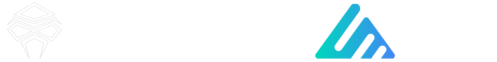
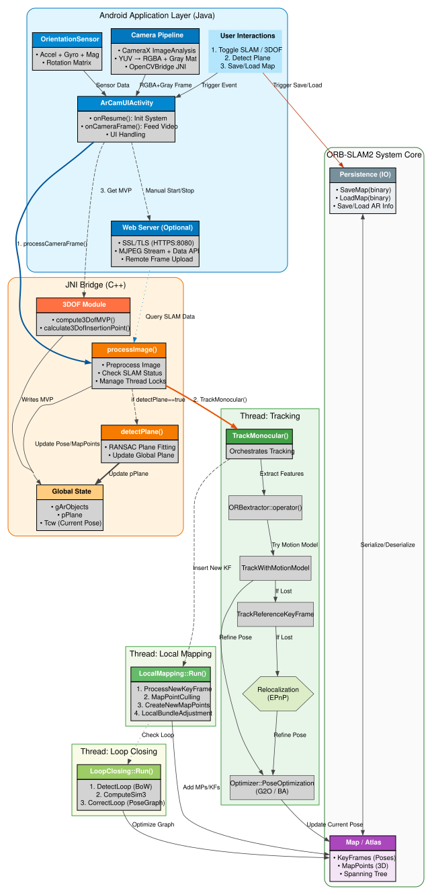

[简体中文](README_zh.md) | [English](../README.md) | [Русский](README_ru.md) | [한국어](README_ko.md) | [日本語](README_ja.md)

## [Глубокая благодарность] Оригинальное ядро ORB-SLAM2:

https://github.com/raulmur/ORB_SLAM2

## [Глубокая благодарность] Оригинальный Android ORB-SLAM2 проект:

https://github.com/Martin20150405/SLAM_AR_Android.git

# ORB-SLAM2s: Android Spatial Computing & Lightweight AR Demo

*Маленькая буква 's' в ORB-SLAM2s означает **Smart · Swift · Small** (Умный · Быстрый · Маленький), подчеркивая усиленный интеллект, более высокую производительность и меньший вес по сравнению с оригинальным ORB-SLAM2.*

Этот проект использует строчную букву 's'. Другая статья с заглавной буквой 'S' называется ORB-SLAM2S：
```
(Y. Diao, R. Cen, F. Xue and X. Su, "ORB-SLAM2S: A Fast ORB-SLAM2 System with Sparse Optical Flow Tracking," 2021 13th International Conference on Advanced Computational Intelligence (ICACI), Wanzhou, China, 2021, pp. 160-165, doi: 10.1109/ICACI52617.2021.9435915.
keywords: {Visualization;Simultaneous localization and mapping;Cameras;Real-time systems;Aircraft navigation;Central Processing Unit;Trajectory;visual SLAM;real-time performance;trajectory accuracy},)
```
У неё схожие концепции оптимизации производительности с этим проектом, хотя её методы ещё не были интегрированы в этот проект. Однако, эта статья может служить ценным источником для будущих направлений оптимизации. Искренняя благодарность учёным за их вклад и обмен знаниями.

## Обзор проекта

**ORB-SLAM2s** - это улучшенный инструмент пространственных вычислений на основе ORB-SLAM2 для Android. Он поддерживает создание разреженных точечных облаков в реальном времени, сохранение/загрузку карт и сопоставление переездов. Объединяя технологии компьютерного зрения, инерциальной навигации (IMU) и дополненной реальности (AR), этот проект обеспечивает стабильную **6DoF** (Шесть степеней свободы) пространственную позицию для мобильных устройств.

### Почему ORB-SLAM2 вместо ORB-SLAM3?

* **Легкий дизайн**: Меньше зависимостей и оптимизированный код, что облегчает компиляцию и развертывание на мобильных платформах.
* **О поддержке IMU и VIO**:
    * **Высокий порог ORB-SLAM3**: VIO в официальной реализации является **жестко связанным (tightly coupled)**, требуя высококачественного IMU и строгой **синхронизации временных меток камеры и IMU**. Это обычно для робототехники, но труднодостижимо "из коробки" на Android-смартфонах через стандартные API.
    * **Реальность Android**: Большинство существующих устройств Android используют асинхронный захват камеры и IMU, не имеют единой системы аппаратной синхронизации, а IMU потребительского класса имеют значительный шум/дрейф. Без строгой калибровки и синхронизации VIO более склонен к расхождению, чем чисто визуальный SLAM. Метод SENSOR_TIMESTAMP доступен только в версиях Android 11 и выше.
* **Низкое потребление ресурсов**: Более низкие требования к CPU и RAM по сравнению с ORB-SLAM3.
* **Практическая эффективность**: Производительность в сценариях только с монокамерой сопоставима с ORB-SLAM3 для стандартных мобильных случаев использования.

---

## Основные функции

* **SLAM-картирование точечных облаков**: Реальное разреженное картирование на основе монокамерного ввода.
* **Сохранение карты**: Поддержка сохранения карт в локальное хранилище и перезагрузки их для будущих сессий.
* **Релокализация и сопоставление**: Оценка позы и сопоставление признаков при загрузке существующих карт.
* **Визуализация достоверности**: Визуальное отслеживание ключевых точек и статистика сопоставления между текущими кадрами и загруженной картой.
* **Обнаружение плоскости**: Интеллектуальное обнаружение пола/поверхности на основе текущей позы и данных точечного облака.
* **Нативный AR-рендеринг**: Базовая реализация AR с использованием OpenGL ES.
* **Обнаружение темных кадров**: Автоматически пропускает темные или низкокачественные кадры, чтобы предотвратить блокировку потока SLAM.
* **Управление AR-объектами**: Поддержка размещения и взаимодействия с 3D-объектами на обнаруженных плоскостях.

---

## Метрики производительности

В настоящее время в основном тестируется на процессорах Qualcomm Snapdragon:

| SoC | Устройство | Производительность |
|-----|--------|-------------|
| Snapdragon 8 Elite | Xiaomi 15 | 30 FPS |
| Snapdragon 8+ Gen1 | Redmi K60 | 30 FPS |
| Snapdragon 870 | Xiaomi 10S | 30 FPS |
| Snapdragon 835 | Xiaomi 6 | 15-20 FPS |

### Обнаружение темных кадров

Для обеспечения плавного пользовательского опыта система отслеживает уровни экспозиции. Когда окружающая среда слишком темная, отслеживание SLAM приостанавливается, чтобы избежать вычислительной задержки и состояний "потери".

---

## Отслеживание прогресса

* [x] SLAM-картирование разреженных точечных облаков
* [x] Функция сохранения/загрузки карт
* [x] Сопоставление релокализации
* [x] Базовый движок AR-рендеринга
* [x] Логика пропуска темных кадров
* [x] Управление 3D AR-объектами
* [x] Одновременная загрузка и сопоставление нескольких файлов карт

## Планы на будущее

* [ ] Улучшить скорость картирования и инициализацию.
* [ ] Улучшить стабильность AR и надежность 6DoF.
* [ ] Оптимизировать конвейер рендеринга для более высоких частот кадров.
* [ ] Углубить объединение датчиков (VIO - визуальная инерциальная одометрия).
* [ ] Интеграция с **Unity3D**.
* [ ] Прореживание частоты SLAM и адаптивная обработка шума.
* [ ] Уточненная логика управления датчиками.

---

## Вспомогательные инструменты

Проект включает несколько инструментов на Python для помощи в разработке и оптимизации:

*   **Vtonax Profiler Viewer (`docs/profiler_tools/vtonax_viewer.py`)**: Преобразует бинарные журналы производительности с устройства в формат Chrome Tracing JSON. Перетащите полученный файл в `chrome://tracing` для детального анализа производительности.
*   **ORB LUT Generator (`docs/generate_tools/generate_orb_lut.py`)**: Предварительно рассчитывает таблицу поиска вращения (LUT) для дескрипторов ORB. Это снижает нагрузку на процессор при работе на мобильных устройствах.
*   **Aesthetic Flowchart Generator (`docs/generate_tools/generate_aesthetic_flowchart.py`)**: Генерирует профессиональные блок-схемы в формате SVG (подобные используемым в этой документации) с помощью Python.

---

## Благодарности

Этот проект построен на следующих превосходных библиотеках с открытым исходным кодом:

* [ORB-SLAM2](https://github.com/raulmur/ORB_SLAM2)
* [DBoW2](https://github.com/dorian3d/DBoW2)
* [g2o](https://github.com/RainerKuemmerle/g2o)
* [Eigen](http://eigen.tuxfamily.org/)
* [OpenCV](https://opencv.org/)

---

# ORB-SLAM2
**Авторы:** [Raul Mur-Artal](http://webdiis.unizar.es/~raulmur/), [Juan D. Tardos](http://webdiis.unizar.es/~jdtardos/), [J. M. M. Montiel](http://webdiis.unizar.es/~josemari/) и [Dorian Galvez-Lopez](http://doriangalvez.com/) ([DBoW2](https://github.com/dorian3d/DBoW2))

ORB-SLAM2 - это библиотека SLAM в реальном времени для **монокамер**, **стерео** и **RGB-D** камер, которая вычисляет траекторию камеры и разреженное 3D-восстановление (в случае стерео и RGB-D с истинным масштабом). Она может обнаруживать циклы и повторно локализовать камеру в реальном времени. Мы предоставляем примеры для запуска SLAM-системы в [KITTI dataset](http://www.cvlibs.net/datasets/kitti/eval_odometry.php) как стерео или монокамеру, в [TUM dataset](http://vision.in.tum.de/data/datasets/rgbd-dataset) как RGB-D или монокамеру, и в [EuRoC dataset](http://projects.asl.ethz.ch/datasets/doku.php?id=kmavvisualinertialdatasets) как стерео или монокамеру.

<a href="https://www.youtube.com/embed/ufvPS5wJAx0" target="_blank"></a>
<a href="https://www.youtube.com/embed/T-9PYCKhDLM" target="_blank"></a>
<a href="https://www.youtube.com/embed/kPwy8yA4CKM" target="_blank"></a>


### Связанные публикации:

[Монокамера] Raúl Mur-Artal, J. M. M. Montiel and Juan D. Tardós. **ORB-SLAM: A Versatile and Accurate Monocular SLAM System**. *IEEE Transactions on Robotics,* vol. 31, no. 5, pp. 1147-1163, 2015. (**2015 IEEE Transactions on Robotics Best Paper Award**). **[PDF](http://webdiis.unizar.es/~raulmur/MurMontielTardosTRO15.pdf)**.

[Стерео и RGB-D] Raúl Mur-Artal and Juan D. Tardós. **ORB-SLAM2: an Open-Source SLAM System for Monocular, Stereo and RGB-D Cameras**. *IEEE Transactions on Robotics,* vol. 33, no. 5, pp. 1255-1262, 2017. **[PDF](https://128.84.21.199/pdf/1610.06475.pdf)**.

[DBoW2 Place Recognizer] Dorian Gálvez-López and Juan D. Tardós. **Bags of Binary Words for Fast Place Recognition in Image Sequences**. *IEEE Transactions on Robotics,* vol. 28, no. 5, pp.  1188-1197, 2012. **[PDF](http://doriangalvez.com/php/dl.php?dlp=GalvezTRO12.pdf)**

# 1. Лицензия

## ORB-SLAM2 Core Library

ORB-SLAM2 основная библиотека выпущена под [GPLv3 лицензией](https://github.com/raulmur/ORB_SLAM2/blob/master/License-gpl.txt). Для списка всех зависимостей кода/библиотек (и связанных лицензий) см. [Dependencies.md](https://github.com/raulmur/ORB_SLAM2/blob/master/Dependencies.md).

Для закрытой версии ORB-SLAM2 для коммерческого использования, пожалуйста, свяжитесь с авторами: orbslam (at) unizar (dot) es.

## Этот проект (ORB-SLAM2s)

Этот проект адаптации и улучшения для Android (ORB-SLAM2s) также лицензирован под **GPL-3.0 License**. См. файлы [LICENSE.txt](../LICENSE.txt) и [License-gpl.txt](../License-gpl.txt) для подробностей.
<br><br>Для сотрудничества по проекту или других вопросов сотрудничества обращайтесь: OlscStudio@outlook.com

## Академические цитаты

Если вы используете ORB-SLAM2 (монокамеру) в академической работе, пожалуйста, цитируйте:

    @article{murTRO2015,
      title={{ORB-SLAM}: a Versatile and Accurate Monocular {SLAM} System},
      author={Mur-Artal, Ra\'ul, Montiel, J. M. M. and Tard\'os, Juan D.},
      journal={IEEE Transactions on Robotics},
      volume={31},
      number={5},
      pages={1147--1163},
      doi = {10.1109/TRO.2015.2463671},
      year={2015}
     }

если вы используете ORB-SLAM2 (стерео или RGB-D) в академической работе, пожалуйста, цитируйте:

    @article{murORB2,
      title={{ORB-SLAM2}: an Open-Source {SLAM} System for Monocular, Stereo and {RGB-D} Cameras},
      author={Mur-Artal, Ra\'ul and Tard\'os, Juan D.},
      journal={IEEE Transactions on Robotics},
      volume={33},
      number={5},
      pages={1255--1262},
      doi = {10.1109/TRO.2017.2705103},
      year={2017}
     }

Если вы используете эту Android-адаптацию (ORB-SLAM2s) в академической работе, пожалуйста, укажите этот открытый исходный URL проекта.

# 2. Предварительные условия

## OpenCV
Мы используем [OpenCV](http://opencv.org) для манипуляции изображениями и признаками. Инструкции по загрузке и установке можно найти на: http://opencv.org. **Требуется как минимум 4.5.0**.

## Eigen3
Требуется для g2o (см. ниже). Инструкции по загрузке и установке можно найти на: http://eigen.tuxfamily.org.

## DBoW2 и g2o (Включены в папку Thirdparty)
Мы используем [DBoW2](https://github.com/dorian3d/DBoW2) и [g2o](https://github.com/RainerKuemmerle/g2o) библиотеки для алгоритмических ссылок. Обе библиотеки (включая лицензии) находятся в папке *Thirdparty*.

Многоязычный перевод предоставлен Qwen3. Пожалуйста, простите любые ошибки и сообщите о них, если они будут найдены.

# О инерциальной навигации (IMU)
Ссылка: https://github.com/Olsc/Android_3dof <br>
Ссылка: https://github.com/ZUXTUO/Android_6dof <br>
Исследование интеграции в проекте еще не завершено.

<p align="center">
  
</p>

---
<br>
<br>

# ♥ Участники

[](https://github.com/Olsc/Android_ORB-SLAM2s/graphs/contributors)
