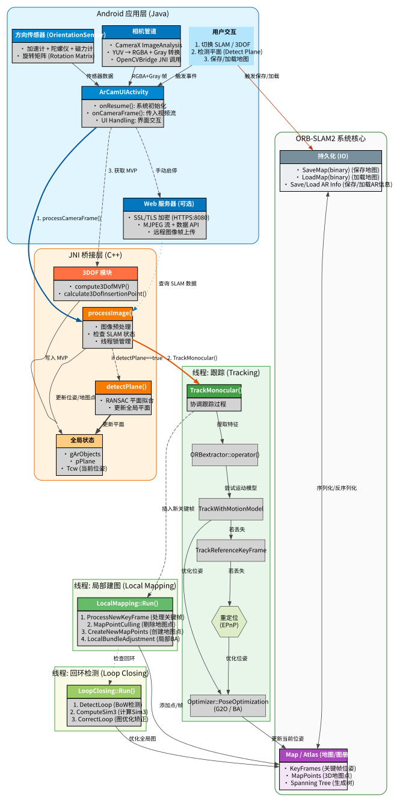

[简体中文](README_zh.md) | [English](../README.md) | [Русский](README_ru.md) | [한국어](README_ko.md) | [日本語](README_ja.md)

## 【郑重感谢】原始ORB-SLAM2核心：

https://github.com/raulmur/ORB_SLAM2

## 【郑重感谢】原始Android ORB-SLAM2项目：

https://github.com/Martin20150405/SLAM_AR_Android.git

# ORB-SLAM2s：Android空间计算与轻量级AR演示

*ORB-SLAM2s中的小写's'代表**智能·快速·小巧**，强调与原始ORB-SLAM2相比，具有增强的智能、更快的性能和更轻的体积。*

本项目使用的是小写s，另外一篇大写S的论文名为ORB-SLAM2S：
```
（Y. Diao, R. Cen, F. Xue and X. Su, "ORB-SLAM2S: A Fast ORB-SLAM2 System with Sparse Optical Flow Tracking," 2021 13th International Conference on Advanced Computational Intelligence (ICACI), Wanzhou, China, 2021, pp. 160-165, doi: 10.1109/ICACI52617.2021.9435915.
keywords: {Visualization;Simultaneous localization and mapping;Cameras;Real-time systems;Aircraft navigation;Central Processing Unit;Trajectory;visual SLAM;real-time performance;trajectory accuracy},）
```
与本文在性能优化上的理念相同，但本文还尚未集成使用此论文里的方法，但此论文或许可作为未来优化方向的优质参考，衷心感谢学者们的付出和共享。

## 项目概述

**ORB-SLAM2s** 是基于ORB-SLAM2的Android增强空间计算工具。它支持实时稀疏点云地图、地图保存/加载和重定位匹配。通过结合计算机视觉、惯性导航（IMU）和增强现实（AR）技术，本项目为移动设备提供稳定的**6DoF**（六自由度）空间定位。

### 为什么选择ORB-SLAM2而不是ORB-SLAM3？

* **轻量级设计**：更少的依赖和精简的代码，使其更容易在移动平台上编译和部署。
* **关于 IMU 与 VIO 支持**：
    * **ORB-SLAM3 的高门槛**：官方实现中的 VIO 是**紧耦合**的，要求高质量 IMU 和严格的**Camera-IMU 时间戳同步**。这在机器人领域常见，但在 Android 手机上通过标准 API 很难做到"开箱即用"。
    * **Android 现状**：现有 Android 设备多为 Camera 与 IMU 异步采集，缺乏统一的硬件同步框架，且消费级 IMU 噪声/漂移较大。若无严格标定和同步，VIO 反而比纯视觉更易发散。安卓11以后的版本才有 SENSOR_TIMESTAMP 方法。
* **低资源消耗**：相比ORB-SLAM3，CPU和RAM需求更低。
* **实用效率**：在仅单目相机场景中的性能与ORB-SLAM3在标准移动用例中相当。

---

## 核心特性

* **点云SLAM映射**：基于单目相机输入的实时稀疏映射。
* **地图持久化**：支持将地图保存到本地存储并重新加载以供将来会话使用。
* **重定位与匹配**：加载现有地图时的姿态估计和特征匹配。
* **置信度可视化**：可视化跟踪关键点以及当前帧与加载地图之间的匹配统计信息。
* **平面检测**：基于当前姿态和点云数据的智能地板/表面检测。
* **原生AR渲染**：使用OpenGL ES的基本AR实现。
* **暗帧检测**：自动跳过暗色或低质量帧以防止SLAM线程阻塞。
* **AR对象管理**：支持在检测到的平面上放置和交互3D对象。

---

## 性能指标

目前主要在高通骁龙平台CPU上测试：

| SoC | 设备 | 性能 |
|-----|--------|-------------|
| Snapdragon 8 Elite | 小米15 | 30 FPS |
| Snapdragon 8+ Gen1 | 红米K60 | 30 FPS |
| Snapdragon 870 | 小米10S | 30 FPS |
| Snapdragon 835 | 小米6 | 15-20 FPS |

### 暗帧检测

为确保流畅的用户体验，系统会监控曝光水平。当环境太暗时，SLAM跟踪会暂停以避免计算延迟和"丢失"状态。

---

## 进度跟踪

* [x] 稀疏点云SLAM映射
* [x] 地图保存/加载功能
* [x] 重定位匹配
* [x] 基础AR渲染引擎
* [x] 暗帧跳过逻辑
* [x] 3D AR对象管理
* [x] 多个地图文件的同时加载和匹配

## 未来路线图

* [ ] 提高映射速度和初始化。
* [ ] 增强AR稳定性和6DoF鲁棒性。
* [ ] 优化渲染管道以获得更高的帧率。
* [ ] 加深传感器融合（VIO - 视觉惯性测程）。
* [ ] 与**Unity3D**集成。
* [ ] SLAM频率降采样和自适应噪声处理。
* [ ] 精细的传感器门控逻辑。

---

## 辅助工具

本项目包含多个 Python 工具，用于辅助开发和性能优化：

*   **Vtonax 分析器查看器 (`docs/profiler_tools/vtonax_viewer.py`)**：将设备导出的二进制性能日志转换为 Chrome Tracing JSON 格式。将生成的 JSON 文件拖入 `chrome://tracing` 即可进行详细的性能瓶颈分析。
*   **ORB 查找表生成器 (`docs/generate_tools/generate_orb_lut.py`)**：预计算 ORB 描述子的旋转偏移查找表 (LUT)。这能有效降低移动设备在运行时的 CPU 开销。
*   **美观流程图生成器 (`docs/generate_tools/generate_aesthetic_flowchart.py`)**：使用 Python 生成专业的项目流程图（如本篇文档中使用的 SVG 图表）。

---

## 致谢

本项目基于以下优秀的开源库构建：

* [ORB-SLAM2](https://github.com/raulmur/ORB_SLAM2)
* [DBoW2](https://github.com/dorian3d/DBoW2)
* [g2o](https://github.com/RainerKuemmerle/g2o)
* [Eigen](http://eigen.tuxfamily.org/)
* [OpenCV](https://opencv.org/)

---

# ORB-SLAM2
**作者：** [Raul Mur-Artal](http://webdiis.unizar.es/~raulmur/)，[Juan D. Tardos](http://webdiis.unizar.es/~jdtardos/)，[J. M. M. Montiel](http://webdiis.unizar.es/~josemari/) 和 [Dorian Galvez-Lopez](http://doriangalvez.com/) ([DBoW2](https://github.com/dorian3d/DBoW2))

ORB-SLAM2是一个实时SLAM库，用于**单目**、**立体**和**RGB-D**相机，计算相机轨迹和稀疏3D重建（在立体和RGB-D情况下具有真实比例）。它能够实时检测循环并重新定位相机。我们提供了在[KITTI数据集](http://www.cvlibs.net/datasets/kitti/eval_odometry.php)上以立体或单目方式运行SLAM系统的示例，在[TUM数据集](http://vision.in.tum.de/data/datasets/rgbd-dataset)上以RGB-D或单目方式运行，以及在[EuRoC数据集](http://projects.asl.ethz.ch/datasets/doku.php?id=kmavvisualinertialdatasets)上以立体或单目方式运行。

<a href="https://www.youtube.com/embed/ufvPS5wJAx0" target="_blank"></a>
<a href="https://www.youtube.com/embed/T-9PYCKhDLM" target="_blank"></a>
<a href="https://www.youtube.com/embed/kPwy8yA4CKM" target="_blank"></a>


### 相关出版物：

[单目] Raúl Mur-Artal, J. M. M. Montiel and Juan D. Tardós. **ORB-SLAM: A Versatile and Accurate Monocular SLAM System**. *IEEE Transactions on Robotics,* vol. 31, no. 5, pp. 1147-1163, 2015. (**2015 IEEE Transactions on Robotics 最佳论文奖**). **[PDF](http://webdiis.unizar.es/~raulmur/MurMontielTardosTRO15.pdf)**.

[立体和RGB-D] Raúl Mur-Artal and Juan D. Tardós. **ORB-SLAM2: an Open-Source SLAM System for Monocular, Stereo and RGB-D Cameras**. *IEEE Transactions on Robotics,* vol. 33, no. 5, pp. 1255-1262, 2017. **[PDF](https://128.84.21.199/pdf/1610.06475.pdf)**.

[DBoW2地点识别器] Dorian Gálvez-López and Juan D. Tardós. **Bags of Binary Words for Fast Place Recognition in Image Sequences**. *IEEE Transactions on Robotics,* vol. 28, no. 5, pp.  1188-1197, 2012. **[PDF](http://doriangalvez.com/php/dl.php?dlp=GalvezTRO12.pdf)**

# 1. 许可证

## ORB-SLAM2核心库

ORB-SLAM2核心库以[GPLv3许可证](https://github.com/raulmur/ORB_SLAM2/blob/master/License-gpl.txt)发布。有关所有代码/库依赖项（及相关许可证）的列表，请参见[Dependencies.md](https://github.com/raulmur/ORB_SLAM2/blob/master/Dependencies.md)。

如需商业用途的闭源版本ORB-SLAM2，请联系作者：orbslam (at) unizar (dot) es。

## 本项目 (ORB-SLAM2s)

此Android适配和增强项目（ORB-SLAM2s）也根据**GPL-3.0许可证**授权。详情请参见[LICENSE.txt](../LICENSE.txt)和[License-gpl.txt](../License-gpl.txt)文件。
<br><br>项目合作或其他领域合作咨询，请联系：OlscStudio@outlook.com

## 学术引用

如果您在学术工作中使用ORB-SLAM2（单目），请引用：

    @article{murTRO2015,
      title={{ORB-SLAM}: a Versatile and Accurate Monocular {SLAM} System},
      author={Mur-Artal, Ra\'ul, Montiel, J. M. M. and Tard\'os, Juan D.},
      journal={IEEE Transactions on Robotics},
      volume={31},
      number={5},
      pages={1147--1163},
      doi = {10.1109/TRO.2015.2463671},
      year={2015}
     }

如果您在学术工作中使用ORB-SLAM2（立体或RGB-D），请引用：

    @article{murORB2,
      title={{ORB-SLAM2}: an Open-Source {SLAM} System for Monocular, Stereo and {RGB-D} Cameras},
      author={Mur-Artal, Ra\'ul and Tard\'os, Juan D.},
      journal={IEEE Transactions on Robotics},
      volume={33},
      number={5},
      pages={1255--1262},
      doi = {10.1109/TRO.2017.2705103},
      year={2017}
     }

如果您在学术工作中使用此Android适配版（ORB-SLAM2s），请适当引用本开源地址URL。

# 2. 先决条件

## OpenCV
我们使用[OpenCV](http://opencv.org)来操作图像和特征。下载和安装说明可在以下网址找到：http://opencv.org。**至少需要4.5.0版本**。

## Eigen3
g2o所需（见下文）。下载和安装说明可在以下网址找到：http://eigen.tuxfamily.org。

## DBoW2和g2o（包含在Thirdparty文件夹中）
我们使用[DBoW2](https://github.com/dorian3d/DBoW2)和[g2o](https://github.com/RainerKuemmerle/g2o)库进行算法上的引用。这两个库（包含许可证）都包含在*Thirdparty*文件夹中。

多语言翻译由Qwen3提供。如有错误请见谅并提交问题。

# 关于 惯性导航（IMU）
参考：https://github.com/Olsc/Android_3dof <br>
参考：https://github.com/ZUXTUO/Android_6dof <br>
本项目尚未研究整合完成。

<p align="center">
  
</p>

---
<br>
<br>

# ♥ 贡献者

[](https://github.com/Olsc/Android_ORB-SLAM2s/graphs/contributors)
